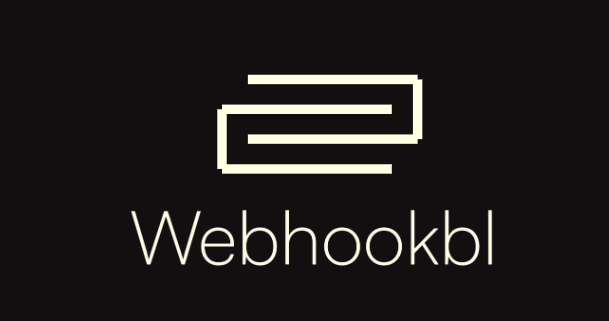
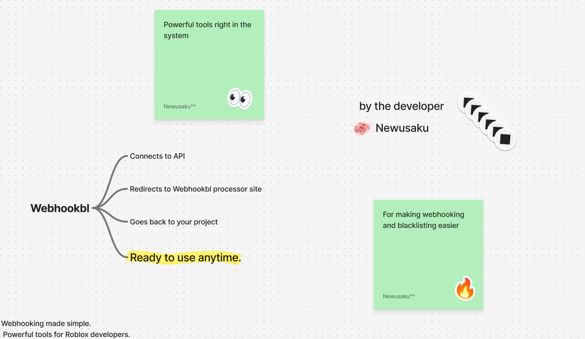

## License

This project is licensed under the Apache License 2.0. See the [LICENSE](LICENSE) file for details.

# Webhookbl

An advanced Roblox webhook management tool for managing and blacklisting webhooks efficiently.

## Features

- Easy webhook management
- Powerful blacklist functionality
- Simple and intuitive interface
- Fast and lightweight
- Easy to self-host
- Has over 10 features

## Installation

```Data Location
```




